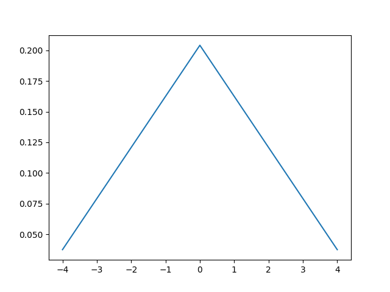
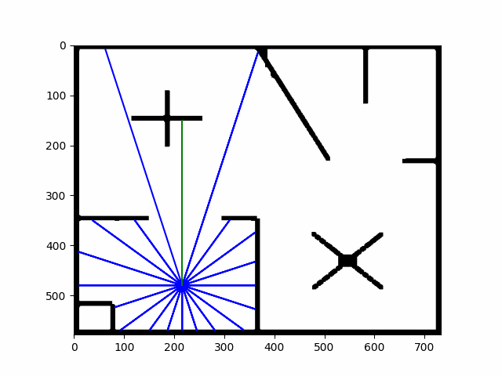
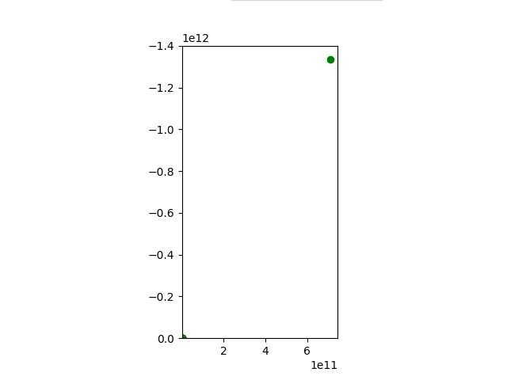
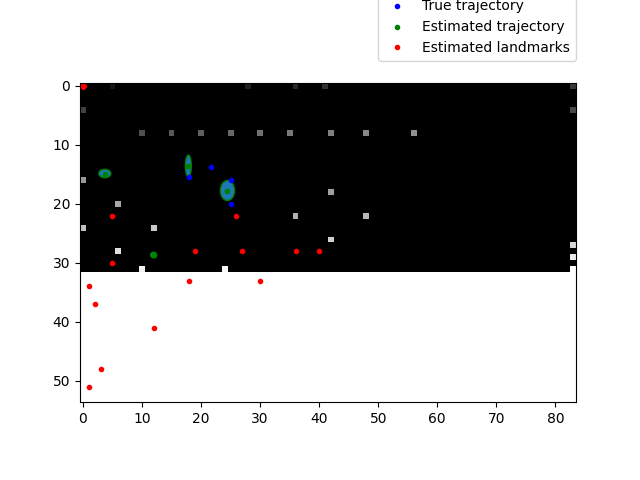

# TEL310
Assignment used in course TEL310/NMBU

This code is not complete!!

## Images from assignment 1:

### prob_normal_distribution:

### prob_triangular_distribution:

### sample_model_velocity:

### sample_model_odometry:

### sample_normal_distribution:

### sample_triangular_distribution:

## Images from assignment 2:

### p_hit:

### p_short:

### p_max:

### p_rand:

### p_all:

### sample_landmark_model:

### animation_front_laser:

### animation_lot_of_readings:

### task2:

## Images from assignment 3:

### EKF_localization:

### EKF_localization_know_correspondence:

### UKF_localization:

## Images from assignment 4:

### Grid_localization:

### MCL_localization:

### Augmented_MCL_localization:

### KDL_sampling_MCL:

## Images from assignment 5:

### EKF Slam known correspondences:

### EKF Slam:
